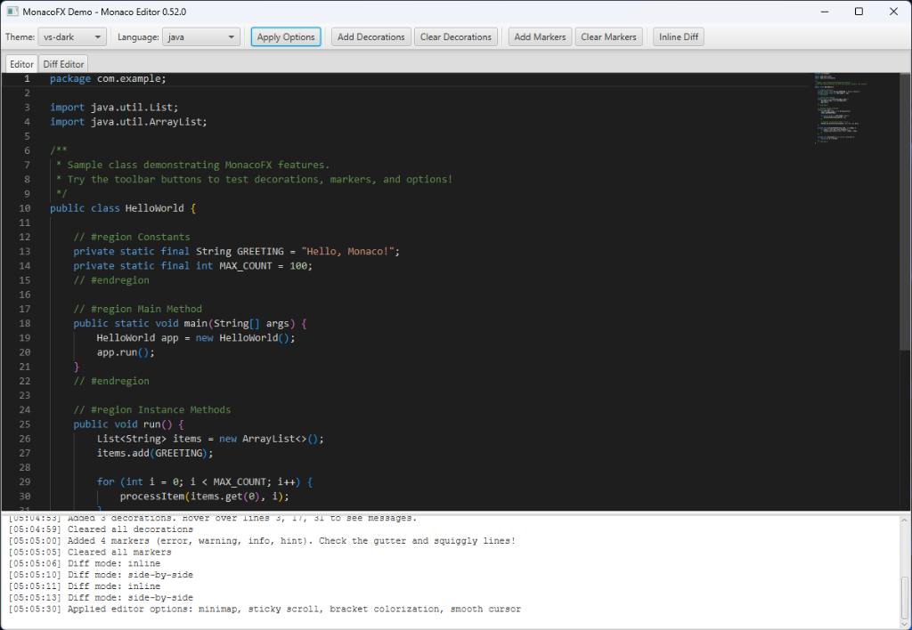
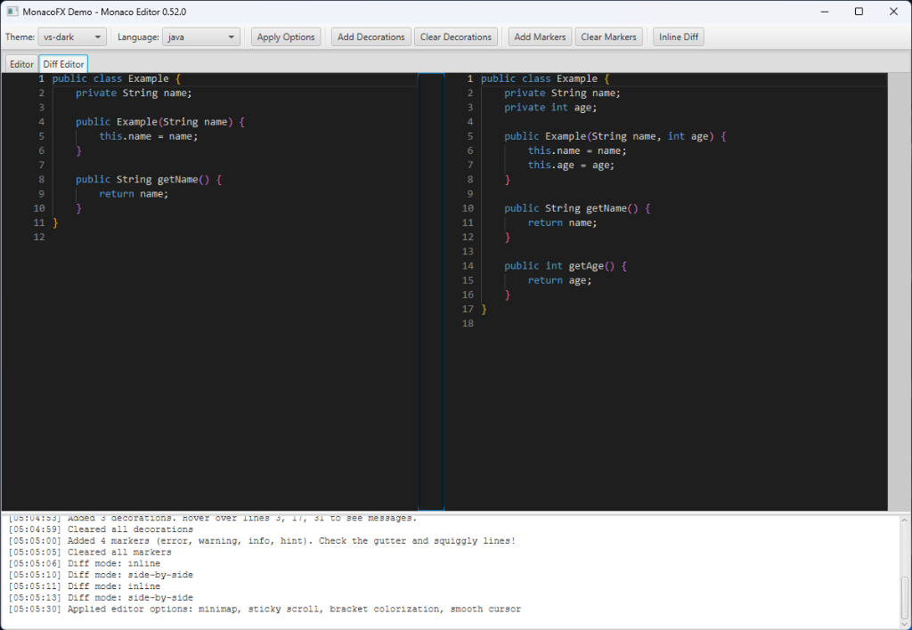

# MonacoFX

> ⚠️ **Updated December 2025**: This project was originally created 4-5 years ago by [Michael Hoffer](https://github.com/miho). It has been updated by **Chris Bunting** to use Monaco Editor 0.52.0 with modern features. **This update has not yet been fully tested.**

A powerful JavaFX wrapper for the [Monaco Editor](https://microsoft.github.io/monaco-editor/) — the same editor that powers [VS Code](https://github.com/Microsoft/vscode).

<table>
<tr>
<td></td>
<td></td>
</tr>
<tr>
<td align="center"><b>Code Editor</b> with minimap, syntax highlighting, bracket colorization</td>
<td align="center"><b>Diff Editor</b> with side-by-side comparison</td>
</tr>
</table>

## Original Author

This project was created by **[Michael Hoffer](https://github.com/miho)** ([@miaborgo](https://twitter.com/miaborgo)).

- Original Repository: [github.com/miho/MonacoFX](https://github.com/miho/MonacoFX)
- Website: [michaelhoffer.de](https://michaelhoffer.de)

---

## Features

### Editor Features
| Feature | Description |
|---------|-------------|
| **Monaco 0.52.0** | Latest stable Monaco Editor with AMD loader |
| **Syntax Highlighting** | 50+ languages built-in |
| **Minimap** | Code overview with section headers |
| **Bracket Pair Colorization** | Colored matching brackets |
| **Sticky Scroll** | Keep scope headers visible |
| **Diff Editor** | Side-by-side and inline diff views |
| **Multiple Themes** | vs-dark, vs-light, hc-black |

### API Features
| Feature | Class | Description |
|---------|-------|-------------|
| **Editor Options** | `EditorOptions` | Configure minimap, fonts, scrolling, etc. |
| **Decorations** | `DecorationsService` | Add error underlines, highlights |
| **Markers** | `MarkersService` | Linting diagnostics (errors, warnings) |
| **Hover** | `HoverProvider` | Show tooltips on hover |
| **Completion** | `CompletionItemProvider` | Custom IntelliSense |
| **Inline Completion** | `InlineCompletionProvider` | AI ghost text suggestions |
| **Go to Definition** | `DefinitionProvider` | Ctrl+Click navigation |
| **Color Picker** | `DocumentColorProvider` | Color swatches for CSS |
| **Find/Replace** | `FindReplaceService` | Search operations |
| **Cursor** | `CursorService` | Position and selection |

---

## Quick Start

### Requirements
- **JDK 17+**
- **Maven 3.8+**

### Maven Dependency
```xml
<dependency>
    <groupId>eu.mihosoft.monacofx</groupId>
    <artifactId>monacofx</artifactId>
    <version>0.2.0</version>
</dependency>
```

### Basic Usage

```java
import eu.mihosoft.monacofx.*;
import javafx.application.Application;
import javafx.scene.Scene;
import javafx.scene.layout.StackPane;
import javafx.stage.Stage;

public class App extends Application {

    @Override
    public void start(Stage stage) {
        MonacoFX editor = new MonacoFX();
        
        // Set content and language
        editor.getEditor().getDocument().setText("console.log('Hello, Monaco!');");
        editor.getEditor().setCurrentLanguage("javascript");
        editor.getEditor().setCurrentTheme("vs-dark");
        
        // Apply modern options
        editor.getEditor().setOptions(EditorOptions.builder()
            .minimap(true)
            .stickyScroll(true)
            .bracketPairColorization(true)
            .build()
        );
        
        stage.setScene(new Scene(new StackPane(editor), 800, 600));
        stage.show();
    }
}
```

---

## Examples

### Diff Editor
```java
DiffEditorFX diffEditor = new DiffEditorFX();
diffEditor.getDiffEditor().setOriginal("Hello World", "text");
diffEditor.getDiffEditor().setModified("Hello Monaco World", "text");
diffEditor.getDiffEditor().setInlineView(false); // side-by-side
```

### Error Highlighting
```java
editor.getDecorationsService().addDecorations(
    Decoration.builder()
        .range(5, 1, 5, 20)
        .className("squiggly-error")
        .hoverMessage("Undefined variable")
        .build()
);
```

### Linting Markers
```java
editor.getMarkersService().setMarkers("myLinter",
    Marker.error("Syntax error", 10, 5, 10, 15),
    Marker.warning("Unused import", 3, 1, 3, 25)
);
```

### Custom IntelliSense
```java
editor.setCompletionProvider("java", (text, position, trigger) -> {
    return List.of(
        CompletionItem.builder()
            .label("System.out.println")
            .kind(CompletionItemKind.METHOD)
            .insertText("System.out.println($1);")
            .build()
    );
});
```

### Go to Definition
```java
editor.setDefinitionProvider("java", (text, position, word) -> {
    // Return location of symbol definition
    return List.of(new Location(new Range(100, 1, 100, 20)));
});
```

---

## Building

```bash
# Compile
mvn clean compile

# Run demo app
mvn javafx:run

# Package JAR
mvn package
```

---

## License

MIT License - see [LICENSE](LICENSE)

## Acknowledgments

- **Michael Hoffer** — Original MonacoFX creator
- **Microsoft** — Monaco Editor
